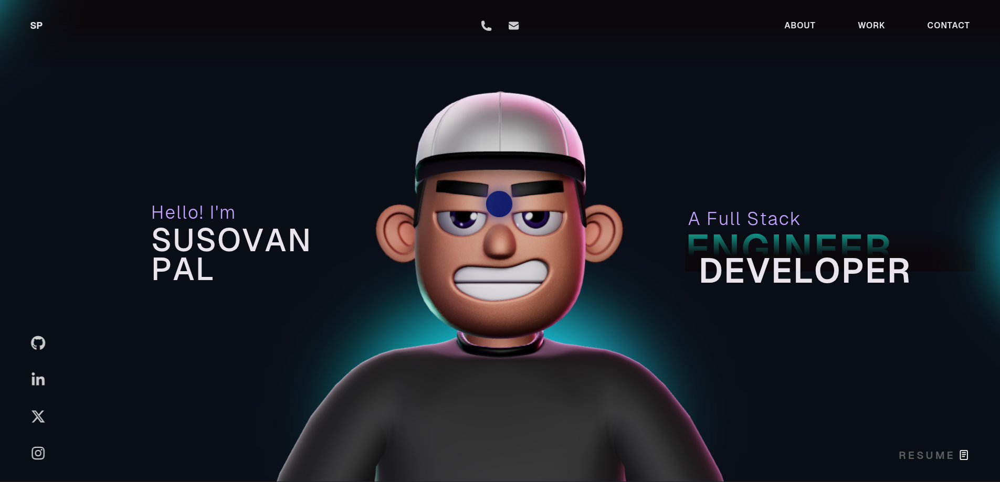

# My Portfolio Website - Overview 🚀

This repository contains the open source version of my portfolio website.
Do check it out!

**Techstack** — React, TypeScript, GSAP, Three.js, WebGL, HTML, CSS, JavaScript



## Running locally 🛠️

```bash
pnpm install
pnpm dev      # start the dev server
pnpm build    # type-check and build for production
pnpm preview  # serve the production build
pnpm lint     # eslint
```

### A note on GSAP plugins

I have modified the GSAP Club plugins with the trial plugins, but with the
trial plugin you cannot host it 🔴. For Club plugins, check out
https://gsap.com/docs/v3/Installation/

## License

This project is open source and available under the [MIT License](LICENSE).
